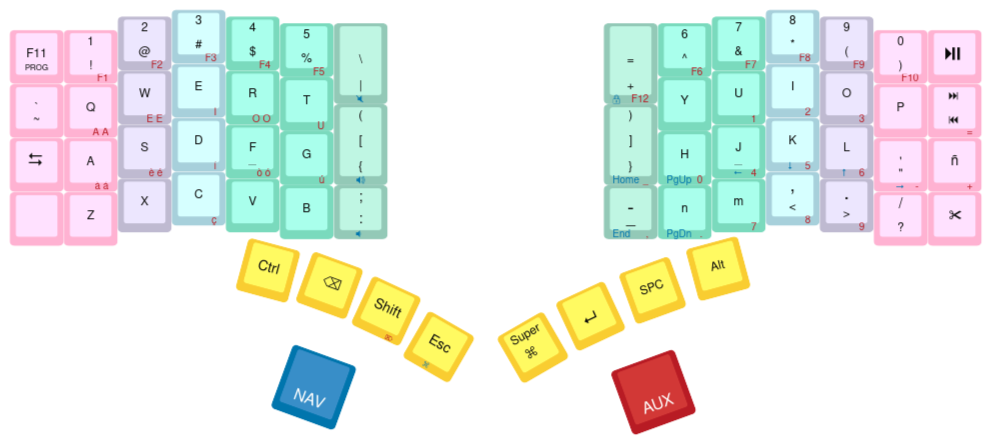

# Kaleidoscope

My custom layouts for Keyboardio Model 01 and Model 100.

[](http://www.keyboard-layout-editor.com/#/gists/89e0b9ceb38f90dcd676edbe32bd696f)

## Usage

Clone this repo to `$HOME`.

```sh
$ make setup
$ export KALEIDOSCOPE_DIR=${HOME}/git/Kaleidoscope
$ echo "export KALEIDOSCOPE_DIR=${HOME}/Kaleidoscope" >> ${HOME}/.bashrc

$ sudo pacman -S arduino arduino-cli arduino-docs arduino-avr-core
$ sudo usermod -aG uucp arnau
```

Not sure if needed

```sh
$ cat /etc/udev/rules.d/01-ttyusb.rules
SUBSYSTEMS=="usb-serial", TAG+="uaccess"
$ sudo udevadm control --reload

# Add module cdc_acm
$ vi /etc/mkinitcpio.conf # MODULES=(.. cdc_acm)
sudo mkinitcpio -p linux
```

### Keyboardio Model 01

```sh
$ cd examples/Devices/Keyboardio/Model01/
$ make compile
$ make flash
```

### Keyboardio Model 100

```sh
$ cd examples/Devices/Keyboardio/Model100/
```

Follow the `README.md` there.

## Sync with upstream

```bash
git remote add upstream git@github.com:keyboardio/Kaleidoscope.git
git merge upstream/master --strategy-option ours
```

## Issues

### Compile fails

If compilation fails with `Invalid argument passed: Platform 'keyboardio:avr' not found`, make sure to sync with upstream

### arduino-cli core install keyboardio:avr fails

<https://gist.github.com/asmallteapot/367fb7582951cf767d2c8e615f4ccaae>

```sh
$ arduino-cli core install keyboardio:avr
Invalid argument passed: Platform 'keyboardio:avr' not found
```

Couldn't manage to fix it
